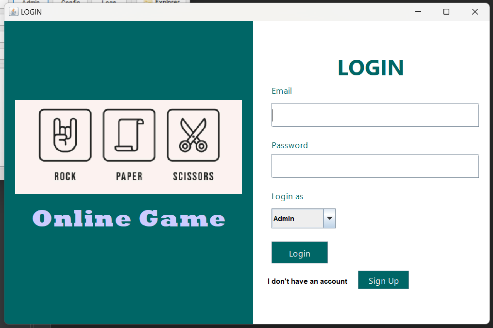
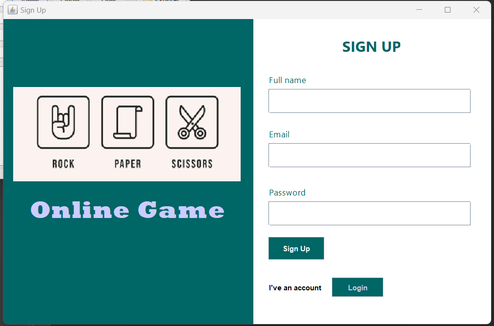
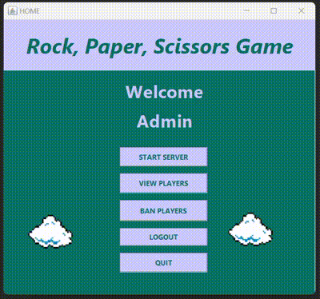
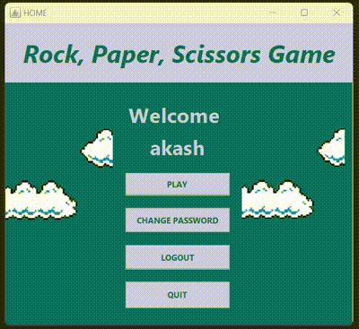
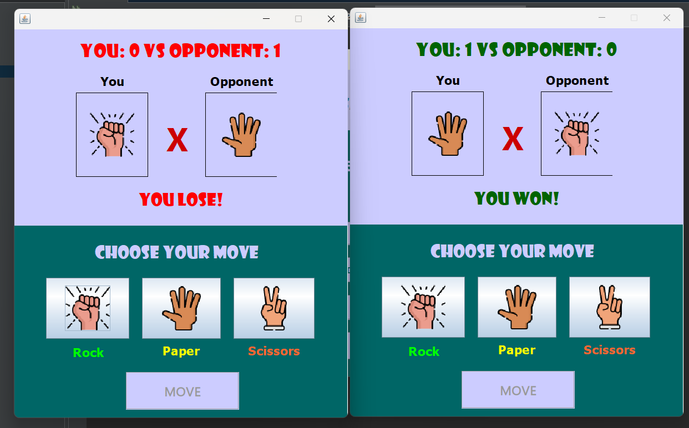

# Rock-Paper-Scissors Game Project

## Overview

This project is a multiplayer Rock-Paper-Scissors game that allows clients to connect and play against each other. The server is managed by an admin, and the game requires two clients to start. The project uses a MySQL database and external JAR files for dependencies (refer to 'jar_file' to resolve issues).

## How to Set Up and Run the Project

To run the project, follow these steps:

1. **Open the project in NetBeans**.
2. **Connect the project with the necessary JAR files**:
   - MySQL JAR file
   - Tritinous-share JAR file
3. **Create a 'rps_game' database** in MySQL.
   - Export the SQL file to set up the database structure.
4. **Configure the `pom.xml` file** (optional):
   - Depending on your NetBeans configuration, you might need to modify the `pom.xml` file to ensure the correct dependencies are loaded.
5. **Clean and build the project** in NetBeans.
6. **Run the project**:
   - You can run the entire project or run the `Home.java` file directly.
7. **Login as the Admin**:
   - Use the following credentials:
     - **Email**: `admin`
     - **Password**: `admin`
   - Start the server from the admin dashboard.
8. **Login as Clients**:
   - The game requires **two clients** to play.
   - Both clients need to log in and connect to the server.

---

## Screenshots

Here are some screenshots of the key screens:

### 1. Login Page

### 2. Sign Up Dashboard

### 3. Admin Dashboard

### 4. Player Dashboard

### 5. Game Interface

